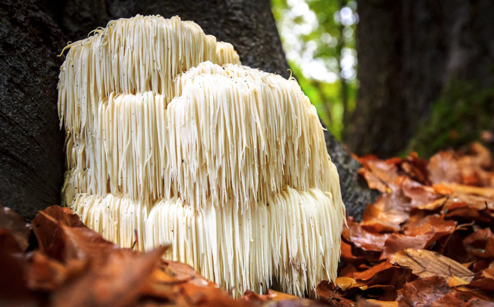
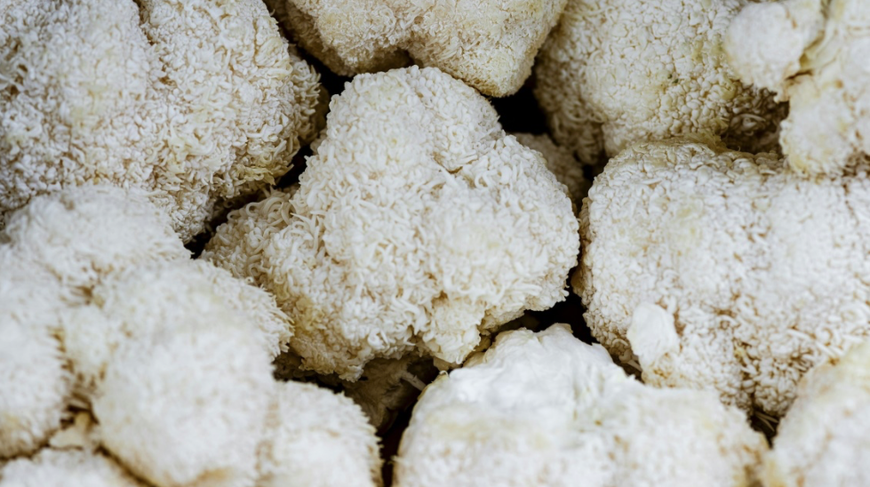

# 🔬 Les Champignons Médicinaux : Superpouvoirs Fongiques Validés par la Science

## Conception de l'article

IA utilisées : Perplexity (rassemblement des sources scientifique), NotebookLM 50 sources (Traduction et génération de contenu en fonction de l'axe), ChatGPT (mise en page Markdown)

## 🧩 Intro

Dans le monde effervescent du biohacking et de la santé, il existe des influenceurs vantant les mérites des champignons **Lion's Mane**, **Chaga** ou **Cordyceps** dans leur café du matin ou leurs smoothies, ou de voir le **Reishi** se démocratiser comme un complément quotidien. Cette tendance marque un changement notable : il y a cinq ans, ces champignons étaient presque inconnus en dehors de cercles de niche, tandis qu'aujourd'hui, ils apparraissent dans les campagnes de communication de **toutes les startups bien-être**.

Pendant des siècles, ces "champignons fonctionnels" ont été des piliers de la médecine orientale et des remèdes populaires, souvent transmis de génération en génération pour leurs propriétés supposées. Cependant, ce n'est que récemment que la science moderne a commencé à revisiter et à valider ces traditions ancestrales, propulsant ces champignons du statut de curiosités marginales à celui d'ingrédients recherchés dans le paysage de la santé contemporaine. Cet intérêt croissant, stimulé par la découverte de leurs **avantages thérapeutiques potentiels**, a attiré l'attention du monde entier.

Mais au-delà du battage médiatique et des anecdotes, que disent réellement les **preuves scientifiques** ? Cet article de blog a pour objectif de **faire un bilan** des bienfaits avérés pour la santé en offrant des clés concrètes pour comprendre leur potentiel. Nous nous pencherons sur la manière dont ces champignons pourraient offrir des avantages significatifs.

## 📋 Plan

1. Intro
2. Qu’est-ce qu’un champignon médicinal ?
3. Lion's Mane : Le champion de la cognition
4. Chaga : L'antioxydant de Sibérie
5. Cordyceps : L'énergisant des hauteurs
6. Tableau récapitulatif synthétique
7. Les champignons médicinaux sont-ils vraiment des "superaliments" ?
8. Exemples concrets d'utilisation
9. Conclusion
10. Sources

## 🍄 **Qu’est-ce qu’un champignon médicinal ?**

Un **champignon médicinal** est au-delà du simple aliment. Ils sont considérés comme des **"aliments fonctionnels"** qui peuvent servir à la fois de nourriture et de médecine. Leurs bienfaits pour la santé proviennent de **composés bioactifs** spécifiques qu'ils contiennent.

L'utilisation de ces champignons n'est pas une nouveauté. Ils sont en fait un pilier des systèmes de médecine ancestraux depuis des siècles, notamment dans la **médecine orientale et la médecine traditionnelle chinoise**. Par exemple, le **Reishi** est un champignon populaire pour son potentiel à renforcer le système immunitaire (1). Le **Chaga** est traditionnellement utilisé pour des affections allant du cancer gastro-intestinal au diabète et aux infections hépatiques (2). Le **Lion's Mane**, ou Crinière de Lion, est utilisé comme aliment et médicament en Chine et au Japon depuis plus de mille ans, notamment pour les problèmes gastriques (3). De même, le **Cordyceps** est un aliment tonique chinois ancestral (4). L'intérêt scientifique contemporain pour ces champignons vise à valider ces usages traditionnels en explorant leurs composés bioactifs.

Il est essentiel de distinguer les différentes catégories de champignons :

• **Champignons comestibles :** Ce sont les champignons que nous consommons principalement pour leur valeur nutritive et leurs qualités culinaires. Ils sont riches en micronutriments, vitamines, minéraux essentiels et fibres alimentaires. De nombreux champignons médicinaux appartiennent également à cette catégorie, étant à la fois nutritifs et thérapeutiques, souvent appelés "champignons culinaires-médicinaux".

• **Champignons médicinaux :** Comme mentionné, ces champignons contiennent des composés spécifiques qui leur confèrent des bienfaits avérés ou potentiels pour la santé, incluant des effets immunomodulateurs, antioxydants, anticancéreux et anti-inflammatoires.

## 🧠 Lion's Mane : Le champion de la cognition

Le Lion's Mane est également connu sous les noms de "crinière de lion". Ce champignon pousse naturellement sur les troncs d'arbres feuillus comme le chêne, le hêtre et l'érable.

### Bienfaits documentés
- Amélioration des fonctions cognitives :
Les recherches montrent que le Lion's Mane peut favoriser la **régénération des neurones** et **améliorer la mémoire et la concentration**. Une étude japonaise menée par [Mori et al. (2009)](https://pubmed.ncbi.nlm.nih.gov/18844328/) sur des adultes âgés a démontré qu'une supplémentation de 250 mg trois fois par jour pendant 12 semaines améliorait significativement les fonctions cognitives par rapport au groupe placebo.

Dans le même sens Lion's Mane stimule la **production de NGF**, découvert par la neurologue italienne [Rita Levi-Montalcini](https://booksofdante.wordpress.com/2024/05/17/la-criniere-de-lion-hericium-erinaceus/) (prix Nobel 1986). Ce facteur de croissance joue un rôle crucial dans la croissance, le maintien et la survie des neurones. Cette propriété en fait un allié potentiel dans la prévention du déclin cognitif lié à l'âge.

Une [étude japonaise de 2010](https://pubmed.ncbi.nlm.nih.gov/20834180/) a révélé que les participants ayant consommé du Lion's Mane pendant quatre semaines ont signalé une **réduction des symptômes d'anxiété** et de dépression par rapport au groupe placebo. Les propriétés anti-inflammatoires et neuroprotectrices du champignon semblent contribuer à cet effet.

### Forme de consommation recommandée

Les extraits standardisés en gélules sont généralement préférés pour leur concentration en principes actifs. Les poudres peuvent être ajoutées aux smoothies ou aux boissons chaudes. Les extraits liquides offrent une meilleure biodisponibilité mais sont moins pratiques à doser.

La dose recommandée varie **entre 500 mg et 1 gramme par jour**, idéalement le matin à jeun. Les premiers effets sur la clarté mentale peuvent apparaître **entre 2 à 6 semaines** de prise régulière. Pour des effets optimaux sur la mémoire et la concentration, une supplémentation de 8 à 12 semaines est généralement conseillée.

## ❄️ Chaga : L'antioxydant de Sibérie
Le Chaga (Inonotus obliquus), également appelé "polypore oblique" ou "champignon de l'immortalité", se distingue par son apparence unique ressemblant à une masse noire et irrégulière, presque comme du charbon. Ce champignon parasite pousse principalement sur l'écorce des bouleaux dans les régions froides comme la Sibérie, le Canada et le nord de l'Europe.

### Principes actifs clés
Le Chaga est exceptionnellement riche en antioxydants, notamment les bêta-glucanes, les polysaccharides, les polyphénols et la mélanine. Sa teneur en antioxydants en fait l'un des aliments les **plus riches de la planète** dans cette catégorie. Il contient également des minéraux et oligo-éléments essentiels : potassium, calcium, magnésium, phosphore, manganèse, zinc, sélénium et iode.

### Propriétés antioxydantes exceptionnelles
Le Chaga possède des propriétés antioxydantes puissantes qui aident à neutraliser les radicaux libres et à **réduire l'inflammation**. Cette action peut contribuer à ralentir le processus de vieillissement cellulaire et à protéger contre les dommages oxydatifs.

Les bêta-glucanes présents dans le Chaga sont reconnus pour **stimuler le système immunitaire**. Ces composés aident à **renforcer les défenses naturelles **de l'organisme et à renforcer les globules blancs qui jouent un rôle crucial dans la défense contre les pathogènes.

La forte teneur en antioxydants du Chaga, en particulier ses polysaccharides et polyphénols, contribue à **réduire l'inflammation dans le corps**. Cette propriété peut être bénéfique pour de nombreux troubles inflammatoires.

Le Chaga est considéré comme un adaptogène, ce qui signifie qu'il aide le corps à s'**adapter aux facteurs de stress**. En régulant les niveaux de cortisol (l'hormone du stress), il peut aider à réduire l'anxiété et à promouvoir un sentiment de calme et de bien-être.

### Études scientifiques majeures

Bien que le Chaga soit largement utilisé en médecine traditionnelle, les **études cliniques chez l'homme restent limitée**
s. La plupart des recherches sont encore au stade préclinique ou in vitro. Cependant, des études sur des modèles animaux ont montré des résultats prometteurs concernant ses propriétés anticancéreuses et immunomodulatrices.
Des [recherches spécifiques sur le SARS-CoV-2](https://pubmed.ncbi.nlm.nih.gov/34900242/) ont examiné l'action antivirale du Chaga, montrant un potentiel d'inhibition du virus. Cependant, ces résultats nécessitent encore des études cliniques chez l'homme pour être confirmés.

### Forme de consommation recommandée

Le Chaga est traditionnellement consommé sous forme de décoction (infusion prolongée dans l'eau chaude). Les extraits en poudre ou en gélules permettent un dosage plus précis et une meilleure concentration des principes actifs.

La dose recommandée varie généralement entre 1 à 2 grammes par jour d'extrait sec. On utilise traditionnellement 5-10 grammes de champignon séché pour 300 ml d'eau, à laisser mijoter 20 minutes. Les effets sur l'immunité et la vitalité peuvent prendre **4 à 8 semaines** pour se manifester pleinement.

## ⚡ Cordyceps : L'énergisant des hauteurs
Le Cordyceps (Cordyceps sinensis) est également appelé "champignon chenille" en raison de son cycle de vie unique : il se développe en parasitant la larve d'une chenille, la transformant en une sorte de "momie" dont il se nourrit. Ce champignon endémique pousse principalement dans les hautes altitudes du Tibet et de l'Himalaya, entre 4000 et 5000 mètres.

### Principes actifs clés
Le principal composé actif du Cordyceps est la cordycépine, un nucléoside aux propriétés pharmacologiques multiples : **antimicrobiennes, antioxydantes et énergétiques**. La cordycépine stimule la production de la molécule énergétique universelle des cellules.

### Amélioration de l'énergie et de l'endurance

Le Cordyceps est reconnu pour sa capacité à augmenter l'utilisation de l'oxygène par les cellules et à améliorer la production d'ATP. Plusieurs études scientifiques confirment son action pour augmenter la puissance musculaire, raccourcir le temps de récupération et favoriser l'élimination de l'acide lactique.

Le Cordyceps aide l'organisme à mieux résister face à la **fatigue émotionnelle** liée au stress. Il agit sur le système immunitaire et permet de dynamiser et **tonifier le corps**, notamment en poussant les capacités physiques et sexuelles.

Les études précliniques suggèrent que le Cordyceps possède des propriétés hépatoprotectrices et peut **soutenir la fonction rénale**. Il aide les organes d'élimination (foie, poumons, reins) dans leur travail de **détoxification**.

### Études scientifiques majeures

Une [étude sur 40 athlètes](https://pubmed.ncbi.nlm.nih.gov/38580687/) masculins a montré une amélioration de la fonction lymphocytaire après six semaines de consommation quotidienne d'extrait de Cordyceps. D'autres recherches précliniques ont démontré ses effets sur l'amélioration de l'absorption d'oxygène par les poumons et l'optimisation du métabolisme énergétique.

Cependant, il est important de noter que la plupart des études rigoureuses restent précliniques, et des essais cliniques randomisés contrôlés chez l'homme sont nécessaires pour confirmer tous ces effets.

### Forme de consommation recommandée

Le Cordyceps est disponible sous forme d'extraits standardisés en gélules, de poudres ou de teintures. Les extraits fermentés (mycélium + champignon) peuvent offrir une meilleure biodisponibilité des nutrients. La forme en gélules permet un dosage précis et une prise pratique.

La dose recommandée varie entre **1 à 3 grammes par jour** d'extrait sec. Pour les effets sur l'énergie et l'endurance, une prise le matin est généralement conseillée. Les premiers effets peuvent apparaître entre 2 à 4 semaines de supplémentation régulière. Pour des effets optimaux sur les performances physiques, une cure de 6 à 8 semaines est souvent recommandée.

## 📊 Tableau récapitulatif synthétique
| Champignon   | Dose quotidienne recommandée | Bienfaits principaux                             | Délai d'effet estimé |
|--------------|------------------------------|--------------------------------------------------|-----------------------|
| Lion's Mane  | 500 mg - 1 g                 | Mémoire, concentration, neuroprotection          | 2-6 semaines          |
| Chaga        | 1-2 g                        | Antioxydant, immunité, anti-âge                  | 4-8 semaines          |
| Cordyceps    | 1-3 g                        | Énergie, endurance, adaptation au stress         | 2-4 semaines          |
| Reishi       | 1-2 g                        | Relaxation, sommeil, immunité                    | 2-8 semaines          |

## 🥦 Les champignons médicinaux sont-ils vraiment des "superaliments" ?

### Comparaison avec la spiruline
La spiruline est reconnue pour sa richesse en protéines (60-70%), en vitamines B et en fer. Les champignons médicinaux offrent une approche différente : plutôt que d'apporter des nutriments de base, ils fournissent des composés bioactifs spécifiques (bêta-glucanes, triterpènes) qui agissent comme des modulateurs physiologiques.

### Comparaison avec le curcuma
Le curcuma agit principalement par sa curcumine aux propriétés anti-inflammatoires. Les champignons médicinaux offrent une action plus large : immunomodulation, adaptation au stress, neuroprotection, selon les espèces.

### Comparaison avec le ginseng
Le ginseng et les champignons médicinaux partagent des propriétés adaptogènes similaires, mais les champignons offrent une diversité d'actions plus large selon les espèces. Le Reishi se rapproche du ginseng pour l'adaptation au stress, mais avec un effet plus relaxant qu'énergisant.

## 🧪 Exemples concrets d'utilisation
### Champignons médicinaux dans la tech et le biohacking
Dans le secteur technologique, le Lion's Mane gagne en popularité pour ses effets sur la concentration et la clarté mentale. Les développeurs et travailleurs intellectuels l'utilisent pour améliorer leur focus pendant les sessions de programmation intensives et réduire le "brouillard mental" lié au stress.

Une étude pilote sur 12 adultes avec TDAH a montré une réduction du brouillard mental avec une prise de 500 mg par jour. Les professionnels de la tech rapportent des améliorations dans la gestion de tâches complexes et la mémorisation d'informations techniques.

### Cordyceps pour les sportifs et biohackers
Le Cordyceps est particulièrement prisé par les athlètes et les adeptes du biohacking pour optimiser leurs performances physiques. Il est utilisé pour améliorer l'endurance, raccourcir les temps de récupération et optimiser l'utilisation de l'oxygène.
Les biohackers l'intègrent dans leurs protocoles d'optimisation des performances, souvent en combinaison avec d'autres adaptogènes comme la rhodiola ou l'ashwagandha.

## ✅ Conclusion

Les champignons médicinaux représentent une convergence fascinante entre les savoirs traditionnels millénaires et la recherche scientifique moderne. Lion's Mane, Chaga, Cordyceps et Reishi offrent chacun des profils d'action spécifiques et complémentaires : neuroprotection et cognition, propriétés antioxydantes, optimisation énergétique, et gestion du stress respectivement.

Les études scientifiques actuelles, **bien que majoritairement précliniques**, confirment de nombreux usages traditionnels et révèlent des mécanismes d'action précis et offrant une approche d'optimisation de la santé plus douce et équilibrée.

Il est essentiel de distinguer les informations scientifiques validées des affirmations marketing souvent exagérées. Les consommateurs doivent privilégier les sources académiques, les revues scientifiques à comité de lecture, et les conseils de professionnels de santé formés à la mycothérapie.

La recherche sur les champignons médicinaux connaît un essor considérable. Les études sur les effets neuroprotecteurs des champignons médicinaux, particulièrement du Lion's Mane, ouvrent des perspectives prometteuses dans la prévention des maladies neurodégénératives et l'optimisation du vieillissement cognitif. Mais également les recherches sur l'utilisation des champignons médicinaux en support des traitements anticancéreux montrent des résultats encourageants pour améliorer la qualité de vie des patients et optimiser l'efficacité des thérapies conventionnelles.

Le marché des champignons médicinaux, évalué à plus de 67 milliards de dollars en 2024, témoigne de cet intérêt croissant. Cette croissance s'accompagne d'investissements importants dans la recherche et le développement, laissant présager des avancées significatives dans les années à venir.
L'avenir de la mycothérapie semble prometteur, mais nécessite le maintien d'une approche scientifique rigoureuse pour distinguer les effets réels des simples effets de mode. Les champignons médicinaux méritent une place dans l'arsenal thérapeutique moderne, mais toujours dans le cadre d'une approche de santé intégrative et éclairée.

## 📚 Sources

- [(1) 6 Benefits of Reishi Mushroom (Plus Side Effects and Dosage)](https://www.healthline.com/nutrition/reishi-mushroom-benefits)
- [(2) Therapeutic properties of Inonotus obliquus (Chaga mushroom)](https://www.tandfonline.com/doi/full/10.1080/21501203.2023.2260408#d1e327)
- [(3) Hericenones and erinacines: stimulators of nerve growth factor (NGF) biosynthesis in Hericium erinaceus](https://www.tandfonline.com/doi/full/10.1080/21501201003735556)
- [(4) The scientific rediscovery of a precious ancient Chinese herbal regimen: Cordyceps sinensis](https://pubmed.ncbi.nlm.nih.gov/9884180/)
- [Rita Levi-Montalcini](https://booksofdante.wordpress.com/2024/05/17/la-criniere-de-lion-hericium-erinaceus/)
- [Etude japonaise de 2010](https://pubmed.ncbi.nlm.nih.gov/20834180/)
- [Mori et al. (2009)](https://pubmed.ncbi.nlm.nih.gov/18844328/)
- [Recherches spécifiques sur le SARS-CoV-2](https://pubmed.ncbi.nlm.nih.gov/34900242/)
- [Etude sur 40 athlètes](https://pubmed.ncbi.nlm.nih.gov/38580687/)

## Nombre de lecteur 

