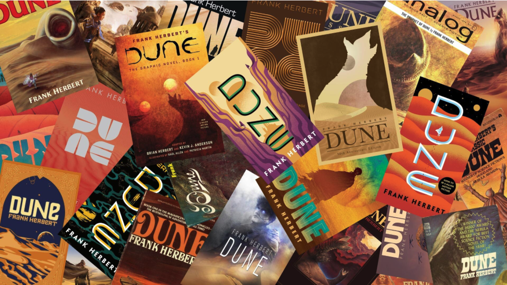
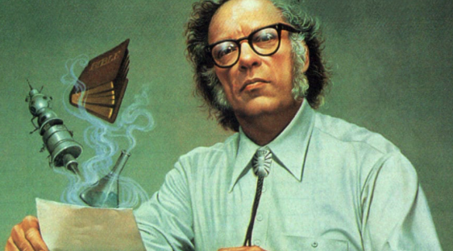

# 🔮 Dune, Fondation et l’IA : Et si les écrivains de SF avaient toujours eu 50 ans d’avance ?

## Conception de l'article

IA utilisées : Chatgpt pour la structure et Perplexity pour les citations tirées des livres.

## 📋 Plan

1. Intro
2. 📚 Présentation rapide des écrivains
3. 🤖 L’IA chez Asimov : un outil socialement encadré
4. 🧠 L’IA chez Herbert : l’interdiction totale après l’horreur
5. 🎯 Des anticipations qui éclairent nos défis actuels
6. 🔮 Les leçons pour aujourd'hui
7. 💬 Conclusion

## 🧩 Intro

ChatGPT rédige nos mails, Midjourney génère des couvertures d’album en deux clics, des robots compagnons tiennent compagnie aux seniors : bienvenue dans l’an 2025, où le quotidien ressemble furieusement à la vieille SF de nos bibliothèques. Alors, si l’on (re)prenait ces romans au sérieux ? Aujourd’hui, on plonge dans les visions d’Isaac Asimov et de Frank Herbert pour interroger le futur de l’intelligence artificielle.

## 📚 Présentation rapide des écrivains

- Isaac Asimov (années 1940-1980) : en pleine Guerre froide et course à l’espace, l’Américain croit que la raison scientifique est le meilleur rempart contre le chaos. Sa SF, optimiste et très « ingénieur », fait des robots des partenaires plutôt que des menaces.

- Frank Herbert (Dune, 1965) : l’heure est à la contre-culture, à la méfiance anti-technologie et aux débuts de l’écologie politique. Herbert brode un space-opera métaphysique où l’humain doit rester maître de ses destinées face aux tentations technologiques.

## 🤖 L’IA chez Asimov : un outil socialement encadré
Isaac Asimov, contrairement à ses contemporains, refusait le complexe de Frankenstein qui dominait alors la science-fiction. Dans ses œuvres, il imaginait une **coexistence entre humains et machines intelligentes**, encadrée par ses fameuses **Trois Lois de la Robotique** :
> « Première Loi : Un robot ne peut porter atteinte à un être humain ni, restant passif, laisser cet être humain exposé au danger. Deuxième Loi : Un robot doit obéir aux ordres donnés par les êtres humains, sauf si de tels ordres sont en contradiction avec la Première Loi. Troisième Loi : Un robot doit protéger son existence dans la mesure où cette protection n'entre pas en contradiction avec la Première ou la Deuxième Loi. »

Plus tard, Asimov introduisit la Loi Zéro, formulée par le robot R. Daneel Olivaw : 
> « Un robot ne peut pas porter atteinte à l'humanité, ni, par son inaction, permettre que l'humanité soit exposée au danger. »

Cette vision asimovienne résonne étrangement avec les **débats actuels sur l'éthique de l'IA**. Lorsque l'UNESCO adopte en 2021 ses recommandations sur l'éthique de l'intelligence artificielle, ou que le Parlement européen appelle à un cadre juridique pour l'IA, on retrouve cette même préoccupation : **comment s'assurer que les systèmes intelligents servent l'humanité ?**

Asimov avait une vision optimiste mais prudente de la technologie, comme le montre cette citation presciente : 

> « Je n'ai pas peur des ordinateurs. J'ai peur qu'ils viennent à nous manquer. » 

Cette phrase, écrite des décennies avant l'ère numérique, anticipe notre dépendance actuelle aux systèmes automatisés.

## 🧠 L’IA chez Herbert : l’interdiction totale après l’horreur
Dans Dune, l’humanité a éradiqué les « machines pensantes » après une guerre sainte, la Jihad Butlérienne. La nouvelle maxime est limpide :

> « Tu ne feras point de machine à l’esprit semblable à celui de l’homme. »

Herbert explique cette méfiance dans son univers : 

> « Les hommes ont confié leur pensée aux machines dans l'espoir d'être libérés. Mais cela a simplement permis à d'autres hommes avec des machines de les asservir. »

À la place, Herbert invente les Mentats : des humains entraînés à calculer comme des ordinateurs, preuve qu’on peut viser le **transhumanisme soft sans silicone**. Cette méfiance résonne avec nos débats sur l’IA décisionnelle : confier la justice prédictive, l’armement autonome ou la modération de masse aux algos revient-il à capituler ? Herbert répondait déjà « non merci ». 

## 🎯 Des anticipations qui éclairent nos défis actuels
### L'IA militaire et les armes autonomes
Les inquiétudes d'Herbert concernant les « machines pensantes » trouvent un écho saisissant dans les débats actuels sur les armes létales autonomes. Comme le souligne une analyse récente : « La prochaine étape est à nos portes: l'utilisation d'armes létales autonomes, c'est-à-dire de robots capables de décider eux-mêmes d'attaquer et de tuer quelqu'un. »

Le Parlement européen a d'ailleurs réitéré « son appel à une stratégie de l'UE relative à leur interdiction ainsi qu'à l'interdiction des 'robots tueurs' », insistant sur le fait que « la décision de sélectionner une cible et d'entreprendre une action létale au moyen d'un système d'arme autonome doit toujours être prise par un humain ».

### La modération algorithmique et le contrôle de l'information
Les systèmes de modération automatisée actuels posent les mêmes dilemmes que ceux anticipés par Herbert. Comme l'explique un expert : « Les algorithmes d'IA peuvent renforcer les préjugés sociétaux existants ou pencher d'un côté des clivages idéologiques. »

Cette situation rappelle la mise en garde d'Herbert dans Le Messie de Dune : 

> « Nous sommes éduqués à croire, et non à savoir. La croyance peut être manipulée. Seul le savoir est dangereux. »

### La justice prédictive et l'algorithme juge

Les systèmes de justice prédictive questionnent directement l'équilibre entre efficacité et humanité. Ces outils « ambitionne[nt] de pouvoir prédire le risque de récidive d'un individu ou la dangerosité de celui-ci », mais soulèvent des questions éthiques majeures sur la discrimination algorithmique.

Asimov avait quant a lui anticipé ces dilemmes dans ses réflexions sur l'autonomie décisionnelle des machines. Sa Loi Zéro, qui place le bien de l'humanité au-dessus de l'individu, préfigure les débats actuels sur les algorithmes de justice prédictive : peut-on accepter qu'une machine prenne des décisions qui affectent le destin d'un être humain ?

## 🔮 Les leçons pour aujourd'hui

Ces deux géants de la science-fiction nous offrent des grilles de lecture complémentaires pour appréhender l'IA contemporaine :

- L'approche d'Asimov nous invite à chercher un cadre éthique et juridique robuste pour l'IA, similaire à ses Trois Lois. Les initiatives actuelles comme la recommandation UNESCO sur l'éthique de l'IA ou les débats sur l'IA responsable s'inscrivent dans cette lignée.

- L'approche d'Herbert, elle, nous met en garde contre une délégation excessive de nos capacités décisionnelles aux machines. Sa vision des Mentats - des humains augmentés plutôt que remplacés - résonne avec les débats actuels sur le « human in the loop » dans les systèmes d'IA critiques.

- Herbert nous rappelle également que la question fondamentale n'est pas technique mais politique : « La question qui se pose pour les humains n'est pas de savoir combien d'entre eux survivront dans le système mais quel sera le genre d'existence de ceux qui survivront. »

Ces deux visions, l'une optimiste mais encadrée, l'autre pessimiste mais humaniste, continuent d'alimenter nos réflexions sur l'avenir de l'intelligence artificielle. Elles nous rappellent que les choix technologiques d'aujourd'hui façonnent la société de demain, et que la science-fiction, loin d'être une simple distraction, constitue un laboratoire d'idées essentiel pour penser notre futur.

## 💬 Conclusion ouverte : Et si on lisait plus de science-fiction ?
Relire Asimov ou Herbert, c’est faire travailler son simulateur de futur interne. Ils ne sont ni devins ni gourous ; ce sont nos complices geeks qui nous chuchotent : « pose les bonnes questions avant de coder la prochaine version ». À vous, désormais, de décider si l’on écrit demain en mode Trois Lois ou Jihad Butlérien … ou un mix inédit.

## Nombre de lecteur 

