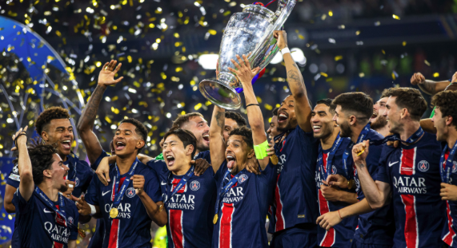

# 🔁 Mercato PSG : si j’étais le directeur sportif cet été…

## 🏁 Introduction
L’été est là, et avec lui son grand bal des transferts.  
Et si, cette fois, c’était moi qui tenais les rênes du Paris Saint-Germain ?  
Objectif : Renforcer l’effectif après l'analyse des failles/qualitées actuelles, Préparer l’avenir et enfin RE-gagner cette foutue Ligue des Champions.  

---

## 💼 Contexte & Philosophie de jeu

### 🔎 Analyse rapide de l’effectif actuel.

Depuis la final, l'équipe type du PSG est clair. Un Onze composé de : Donnaruma, Hakimi, Marquinhos, Pacho, Nuno Mendes, Vitinha, Fabian, Joas Neves, Kvara, Doué et enfin le Ballon d'Or : Dembélé. 

On sait également que les choix, dans l'ordre, des remplacements sont #1 Barcola, #2 Warren et #3 Mayulu. Ce sont les trois seuls qui peuvent rentrer et apporter quelque chose. Les autres sont clairement là pour reposer les titulaires.

J'en viens donc à tirer les leçons suivantes :

- Points forts : jeunesse montante, adaptabilité (jeu rapide ou jeu de possession), solidité défensive, effectif polyvalent, Joueurs exemplaires (pas de frasques, peu de blessures).
- Points faibles : Peu de remplacent fiable donc faible concurrence a certains postes, Certains postes pas doublés.

### 🎯 Objectif du mercato
- Doubler chaque poste pour apporter un vrais concurrence ou au moins turnover interessant.
- Philosophie : équilibre entre stars confirmées et pépites, priorité à la cohérence collective.
- Style de jeu visé : pressing haut, verticalité, technique et polyvalence.
- Apporter une nouvelle motivation pour gagner la LDC, avec des joueurs qui ne l'ont pas encore gagnée.

---

## 💸 Joueurs à vendre ou prêter

| Joueur           | Raison du départ                          | Prix estimé  |
|------------------|--------------------------------------------|--------------|
| Safonov   | Transfert incompréhensibles, n'apporte rien de plus qu'un Tenas        | 5 M€        |
| Berraldo   | Trop de gauché en défense, priorité aux titis        | 15 M€        |
| Hernandez   | Gros salaire, remplaçant sur la pente descendante, je le verrais bien rejoindre son frère en Arabie Saoudite contre un beau chèque    | 35 M€        |
| Gonçalo Ramos   | J'adore le joueur, donc justement je souhaite qu'il joue. Il mérite d'être titulaire dans un autre club | 45 M€ |
| Kolo Muani   | Pareil, top joueur mais difficile d'imaginer Enrique le re-intégrer | 45 M€ |

Ensuite il y a les joueurs à ne surtout pas récupérer de prêt : Skriniar, Soler, Mukiele, Renato Sanchez et Asensio

> 💡 Petite réflexion : ***Gabriel Moscardo***, n'ayant aucune idée de son niveau, je partirais plus sur une vente d'après ce que j'entends (blesse beaucoup).

---

## 🧱 Recrues ciblées : 4 profils, 4 idées

### 🛡️ 1. Défenseur central
- Nom : ***Loic Badé (FC Séville)***.
- Profil : moderne, solide, bon relanceur, jeune et surtout Droité.
- Coût : 35 - 40 M€
- Impact : renforcer le turnover en défense central, il aura a coup sur beaucoup de temps de jeu malgrès son statut de remplaçant.
- Bonus : Se rapprocherai de l'EDF.

### ⚡️ 1. Défenseur latéral droit
- Nom : ***Dodô (Fiorantina)***.
- Profil : solide, bon relanceur, combatifs.
- Coût : 30 - 35 M€
- Impact : Permettra de faire souffle Hakimi.
- Bonus : Hakimi absents pendants plusieurs semaine avec la CAN.

### 🎮 2. Milieu de terrain
- Nom : ***Javi Guerra (Valence)***
- Profil : box-to-box ou créateur selon l’équilibre de l’équipe.
- Pourquoi lui ? Bon premier contrôle orienté vers avant, passes verticales rapides, Style fabian ruiz mais penchant plus à droite.
- Coût : 40 M€
- Autre choix : ***Ruben Loftus-Cheek (AC Milan)***, ***Merlin Röhl (Freiburg)***.

### 🚀 3. Attaquant
- Nom : ***Rodrigo (Real Madrid)***.
- Profil : Joueur Luis Enrique - compatible, travailleur, expérience, jeune.
- Coût : 80 M€
- Impact : Peut permettre de soulager le Real donc bonne opportunité, c'est devenue un vrais joueur de couloir droit alors qu'aujourd'hui nous n'en avons aucun depuis le replacement dans l'axe de Dembele.
- Second choix : ***Bryan Mbeumo*** : Sors d'une très bonne saison en première league, est transférable, Joue a droite et marque beaucoup, bon volume défensif ...

#### En bonus
- ***Antonee Robinson (Fulham)*** : Pour remplacer Nuno, pas sur qu'il accepte le rôle de remplacant, pas sur qu'il soit compatible avec le style de jeu du PSG ... Mais les bonnes pioches ont déjà été prises en début de mercato
- ***Calvin Bassey (Fulham)*** : Défenseur central gauché pouvant jouer à gauche pour remplacer Nuno Mendes. Mais beaucoup plus central ...

---

## ⚖️ Bilan final
Pour un budget total d'achat de 195 M€ et vente de 145 M€, je pense que l'effectif actuel gagne en :
- Profondeur défensive + rotation latérale (Badé, Dodô) → saison longue mieux gérée; Hakimi protégé.
- Jeunesse de qualité (Guerra) → développement futur + style Luis Henrique.
- Star offensive polyvalente (Rodrygo) → renforce la ligne d’attaque côté droit, apporte clutch UCL potentiel.

Par contre, il faudra faire attention à :
- Budget fortement concentré (Rodrygo représente >60% de l’enveloppe transferts).
- Ne répond pas forcément tous les besoins (ex : si Mendes se blesse).
- Intégration de 4 profils venant de ligues différentes = charge adaptation staff/cohésion.

Ce mercato fictif, est avant tout un exercice d’équilibre entre passion, raison et projet de jeu.  
***Et toi, t’aurais vendu qui ? Tu recrutes qui ? ***

## Nombre de lecteur 

