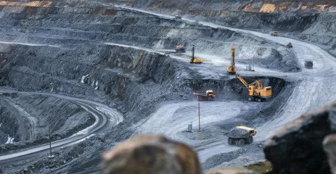

# 🚗🔋 *Lithium vs Pétrole* : Ce que j’ai découvert sur les réserves mondiales pour faire rouler nos voitures

Alors que la voiture électrique est souvent présentée comme l’alternative « propre » aux véhicules thermiques, une question cruciale persiste : **a-t-on assez de lithium pour alimenter une flotte mondiale, comme on l’a fait avec le pétrole pendant un siècle ?**  
Après avoir fouillé des dizaines de publications scientifiques, j’ai été frappé par **l’ampleur de l’écart entre les deux ressources**, non seulement en termes de **volume**, mais surtout de **logique de consommation**.

## 🌍 Réserves mondiales : un écart vertigineux

| Ressource      | Réserves mondiales estimées | Extraction annuelle (2024) | Autonomie au rythme actuel |
|----------------|------------------------------|-----------------------------|-----------------------------|
| **Pétrole**     | 239 à 280 milliards de tonnes | 4 milliards de tonnes       | 50 à 60 ans                 |
| **Lithium**     | ~30 millions de tonnes        | 240 000 tonnes              | ~120 ans                   |

> En **masse**, les réserves de lithium ne représentent que **0,05 %** de celles de pétrole. Mais attention : **l’usage et le recyclage sont radicalement différents**.

---

## 🔄 Consommation : brûler ou immobiliser

### Sur 100 000 km parcourus :

| Type de véhicule      | Masse consommée/utilisée | Destin final        |
|------------------------|--------------------------|----------------------|
| **Voiture thermique**  | ~4 800 kg de pétrole     | Brûlé, perdu         |
| **Voiture électrique** | 3 à 5 kg de lithium      | Immobilisé, recyclable |

👉 Une voiture thermique **brûle 1 000 fois plus de matière** qu’une voiture électrique ne mobilise de lithium.  
Et ce lithium n’est **ni brûlé, ni dispersé** : il reste dans la batterie, potentiellement **réutilisable à 95 %**.

---

## 📊 Détail : combien faut-il de lithium par voiture ?

| Capacité batterie (kWh) | Masse de lithium (approx.) |
|-------------------------|-----------------------------|
| 24 kWh (petite citadine) | ~2,7 kg                     |
| 50 kWh (moyenne gamme)   | ~5,6 kg                     |
| 100 kWh (gros véhicule)  | ~11 à 13 kg                 |

La consommation ne dépend donc pas du kilométrage, mais **du nombre de batteries produites**.  
Une batterie est conçue pour durer **150 000 à 250 000 km**, voire plus, sans recharge de lithium.

---

## 🧮 Peut-on électrifier tout le parc mondial ?

Prenons une estimation grossière :

- 1 voiture électrique moyenne = **5 kg de lithium**  
- 1 milliard de véhicules à électrifier = **5 millions de tonnes** de lithium

> Sur **30 millions de tonnes de réserves**, on pourrait produire **6 milliards de véhicules** (théoriquement).  
> En comparaison, on **brûle chaque année 4 milliards de tonnes** de pétrole.

Mais attention :

- **Le lithium est mal réparti**, concentré dans peu de pays  
- **L’extraction est énergivore et impactante**  
- Le recyclage **n’est pas encore généralisé**

---

## 🔁 Vers une économie circulaire ?

Contrairement au pétrole, **le lithium peut entrer dans une logique circulaire**.  
Une fois extrait, il est réutilisable **pendant plusieurs décennies**, avec des taux de récupération qui dépassent déjà **90%** dans certains procédés industriels.

Cela change fondamentalement la logique : on passe **d’un flux à usage unique à un stock réutilisable**.

---

# 🧠 Conclusion : le vrai enjeu, ce n’est pas la quantité

Si on regarde uniquement les masses disponibles, le pétrole semble toujours roi.  
Mais ce que j’ai découvert, c’est que le **vrai rapport de force se joue ailleurs** :

- Le pétrole est **perdu à chaque kilomètre**
- Le lithium est **stocké, recyclé, optimisable**

Le défi majeur ne réside donc **pas dans les réserves**, mais dans notre **capacité à extraire proprement, à recycler efficacement et à structurer une chaîne logistique mondiale du lithium**.

> ⚠️ En résumé : **Le pétrole est abondant, mais éphémère. Le lithium est rare, mais durable.**

## Sources

- [Terre rare — Wikipédia](https://fr.wikipedia.org/wiki/Terre_rare)
- [Les mines de fer — Déco Fer Forgé](https://www.decoferforge.com/blog/article-19/Exploitation-des-mines-de-fer)
- [Les terres rares sont-elles si rares ? — Connaissance des Énergies](https://www.connaissancedesenergies.org/idees-recues-energies/les-terres-rares-sont-elles-si-rares)
- [Marché des terres rares 2022 — Mineralinfo](https://www.mineralinfo.fr/fr/ecomine/marche-des-terres-rares-2022-filieres-dapprovisionnement-aimants-permanents)
- [Enjeux pour la France et l’Europe — Vie Publique](https://www.vie-publique.fr/parole-dexpert/289457-terres-rares-quels-enjeux-pour-la-france-et-leurope)
- [Quelle quantité de pétrole a-t-on déjà extraite ? — Science & Vie](https://www.science-et-vie.com/article-magazine/quelle-quantite-de-petrole-a-t-on-deja-extraite)
- [Production mondiale et réserves de pétrole — CPDP](https://www.cpdp.org/modules/custom/gc_minipdf/pdf/NIE-975-Prod-mondiale-petrole-brut-et-reserves.pdf)
- [Pétrole — Wikipédia](https://fr.wikipedia.org/wiki/P%C3%A9trole)
- [L’abondance des métaux rares sous-marins — Atlante](https://www.atlante.fr/labondance-des-metaux-rares-sous-marins-un-nouvel-eldorado-encore-loin-detre-accessible/)
- [Métaux & terres rares dans les VE — AutoPlus](https://www.autoplus.fr/environnement/metaux-terres-rares-voiture-electrique-1296948.html)
- [Comparatif des coûts essence/diesel/électrique — CarteGrise.com](https://www.cartegrise.com/blog/2024/01/gazole-essence-electrique-comparatif-des-couts-sur-100-km)
- [Les terres rares dans les batteries VE — Sneci](https://www.sneci.com/les-terres-rares-sont-elles-un-enjeu-dans-la-production-de-batteries-pour-ve/)
- [L’enjeu des métaux critiques — Roole](https://media.roole.fr/transition/voiture-propre/batteries-de-voitures-electriques-lenjeu-des-metaux-critiques)
- [Choisir entre diesel ou essence — ByMyCar](https://www.bymycar.fr/webzine/choisir-entre-diesel-ou-essence-selon-le-kilometrage-annuel/)
- [Les batteries et les terres rares — Automobile Propre](https://www.automobile-propre.com/dossiers/les-batteries-et-lenjeu-des-terres-rares/)
- [Moteur électrique et terres rares — Construire sa moto électrique](https://construire-sa-moto-electrique.org/moteur/terres-rares)
- [Calcul consommation essence — CalculConversion](https://www.calculconversion.com/calcul-consommation-essence.html)
- [FAQ sur la voiture électrique — Carbone 4](https://www.carbone4.com/analyse-faq-voiture-electrique)
- [Voitures électriques et usure des freins — FNA](https://fna.fr/le-freinage-pour-vehicule-electrique-un-equilibre-entre-innovation-et-securite/)
- [Freinage VE vs thermique — Les Numériques](https://media.roole.fr/transition/voiture-propre/voitures-electriques-pourquoi-leurs-freins-susent-ils-moins-vite)
- [Entretien des freins VE — MotoIntegrator](https://www.motointegrator.fr/blog/entretien-des-freins-sur-les-vehicules-electriques/)
- [Entretien voiture électrique — Charge-in](https://charge-in.fr/blog/comment-entretenir-sa-voiture-electrique/)
- [Usure moteur électrique — Fiches Auto](https://www.fiches-auto.fr/articles-auto/voiture-electrique/s-2615-comment-s-use-un-moteur-electrique-.php)
- [Facteurs d’inefficacité moteur électrique — Chuno Motor](https://chunomotor.com/fr/what-factors-can-cause-electric-motor-inefficiencies/)
- [Production de batteries — GoFast](https://www.gofast.swiss/fr/blog/posts/production-de-batteries)
- [Refroidisseurs et composants électriques — Mersen](https://www.mersen.com/fr/tous-les-marches/revolutionner-lenergie-avec-les-fusibles-condensateurs-refroidisseurs-et-bus-bars)
- [Déchets électroniques — Wikipédia](https://fr.wikipedia.org/wiki/D%C3%A9chets_d)
- [Usure prématurée des pneus VE — Les Numériques](https://www.lesnumeriques.com/voiture-electrique/les-voitures-electriques-usent-prematurement-leurs-pneus-et-c-est-une-mauvaise-nouvelle-pour-la-planete-n214077.html)
- [Pollution des plaquettes VE — Auto Orange](https://auto.orange.fr/green-auto/news/les-plaquettes-de-frein-des-voitures-electriques-plus-polluantes-que-les-moteurs-diesel-CNT000002hOm2U.html)
- [Secteur électrique et métaux — Bronmetal](https://www.bronmetal.com/fr/secteur/electrique/)
- [Quantité de lithium dans une batterie — ByMyCar](https://www.bymycar.fr/webzine/combien-de-lithium-dans-une-batterie-de-voiture-electrique/)
- [Composition batterie VE — Elmy](https://elmy.fr/guide/voiture-electrique/batterie-voiture-electrique-composition-duree-de-vie-impact)
- [Impact des batteries VE — Izi by EDF](https://izi-by-edf.fr/blog/batterie-voiture-electrique/)
- [Exploitation lithium et batteries VE — Blog Maison Écologique](https://blog-maison-ecologique.fr/voiture-ecologique/exploitation-lithium-batteries-voitures-electriques)
- [Batteries lithium : enjeux — Magazine B2B](https://www.magazineb2b.com/voitures-electriques-batterie-lithium.html)
- [Fiche élément lithium — L’Élementarium](https://lelementarium.fr/element-fiche/lithium/)
- [Le lithium en France — Connaissance des Énergies](https://www.connaissancedesenergies.org/questions-et-reponses-energies/lithium-ou-en-est-la-france-dans-la-course-mondiale-lapprovisionnement)
- [Faits lithium — Gouvernement du Canada](https://ressources-naturelles.canada.ca/mineraux-exploitation-miniere/donnees-statistiques-analyses-exploitation-miniere/faits-mineraux-metaux/faits-lithium)
- [Production mondiale de lithium — Statista](https://fr.statista.com/statistiques/702647/production-lithium-en-mine-monde/)
- [Politique d’approvisionnement lithium — Policy Center](https://www.policycenter.ma/sites/default/files/2025-03/PB_15-25%20Yves%20Jegourel.pdf)

## Nombre de lecteur 

