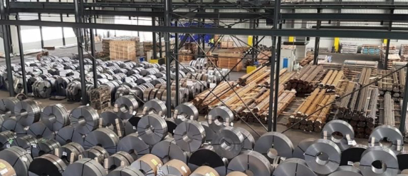

# 🏗️ L'acier : état du marché mondial entre excès, transition et opportunités

L'acier est un matériau fondamental de notre civilisation moderne : immeubles, infrastructures, automobiles, énergie... tout ou presque repose sur ses propriétés uniques. Mais alors que la transition énergétique s'accélère, j'ai voulu savoir si ce "pilier invisible" est réellement prêt pour le monde de demain.

## 📜 Un peu d'histoire : de la trempe au haut-fourneau

L'acier, alliage de fer et de carbone, est connu depuis l'Antiquité : Chine impériale, Inde avec l'acier wootz, Europe médiévale. Mais la véritable révolution vient au XIXe siècle avec Henry Bessemer, qui invente en 1856 le premier procédé industriel permettant de produire de l’acier en masse et à bas coût.

> 📌 En 1900, la production mondiale ne dépassait pas 28 millions de tonnes. En 2024, elle atteint **1,88 milliard de tonnes**.

---

## 📊 Le marché mondial actuel de l’acier (2024–2025)

| Pays | Production (Mt) | % du total mondial |
|------|-----------------|--------------------|
| Chine | 1005,1 | 53,3% |
| Inde | 140,8 | 7,4% |
| Japon | 87 | 4,6% |
| États-Unis | 81,4 | 4,3% |
| UE (total) | 129,5 | ~7% |

- 📉 Le marché est **en légère contraction** (-1% en 2024), mais les surcapacités persistent (~550 à 600 Mt).
- 🚨 **100 à 120 Mt** ont été exportées par la Chine, soit l'équivalent de la consommation européenne.
- 🧱 L'acier est utilisé à **52% dans le BTP** et **12% dans l'automobile**.

---

## 📉 Problèmes structurels : surcapacités et distorsions de concurrence

- 🌐 **Surcapacités estimées à 602 Mt** en 2024, attendues à **721 Mt en 2027**.
- 💸 Subventions massives en Chine : 10× plus élevées que dans les pays OCDE.
- 🔒 L’Europe peine à se protéger malgré le mécanisme MACF (ajustement carbone aux frontières prévu pour 2026).

---

## 🧪 Innovations & transition : de l’acier fossile à l’acier vert

- ♻️ **L’acier est recyclable à 100%** sans perte de qualité.
- 🔋 L'**hydrogène vert** et l’**électrolyse à oxyde fondu** sont les grandes promesses de décarbonation.
- ⚙️ **74% d’énergie économisée** et **58% d’émissions CO₂ évitées** avec l’acier recyclé.

> 📍 Exemple : H2 Green Steel prévoit 2,5 Mt d’acier vert dès 2026, avec -95% de CO₂ par tonne.

---

## ⚖️ Le grand défi : la pénurie de ferraille recyclée

| Année | Demande de ferraille | Offre de ferraille | Solde |
|-------|----------------------|--------------------|-------|
| 2021 | ~670 Mt | ~661 Mt | +9 Mt |
| 2030 (proj.) | 883 Mt | 868 Mt | **–15 Mt** |

- 🏭 Les fours électriques (EAF) deviennent dominants (29% → 41% en 2030).
- 🇪🇺 L'Europe pourrait manquer de **9 Mt de ferraille propre** par an dès 2030.
- 📈 Les prix du "prime scrap" montent déjà : +25% en 3 mois en 2025.

---

## 🧭 Vers quoi investir ?

| Thème | Intérêt stratégique | Exemples |
|-------|---------------------|----------|
| ♻️ Recyclage acier | Recyclage x5 à Fos, Dunkerque | ArcelorMittal, technologies de tri |
| 🌿 Acier vert | Objectif CO₂ –95% | H2 Green Steel, Boston Metal |
| 🛡️ Protectionnisme européen | MACF, quotas carbone | Suivre les ETF industriels ciblés |
| 🔋 Fers secondaires | Ferraille = nouvel or | Collecte, fusion, raffinage |
| ⚡ Transition énergétique | Réseaux = +40 Mt d’acier/an | Infrastructures, ENR |

---

## ✅ Conclusion : un géant en mutation

L'acier est partout. Mais sa production actuelle **rejette 2,8 milliards de tonnes de CO₂** par an (7% du total mondial).  
Les réserves de minerai de fer sont abondantes. Le vrai défi est ailleurs :  
**la transformation technologique, la sécurisation de la ferraille, et le pilotage géopolitique du marché.**

> L’investissement dans **l’acier propre**, **les technologies de recyclage**, et **les industriels anticipant la transition carbone**, apparaît comme **un pari stratégique à long terme**.

## Nombre de lecteur 

