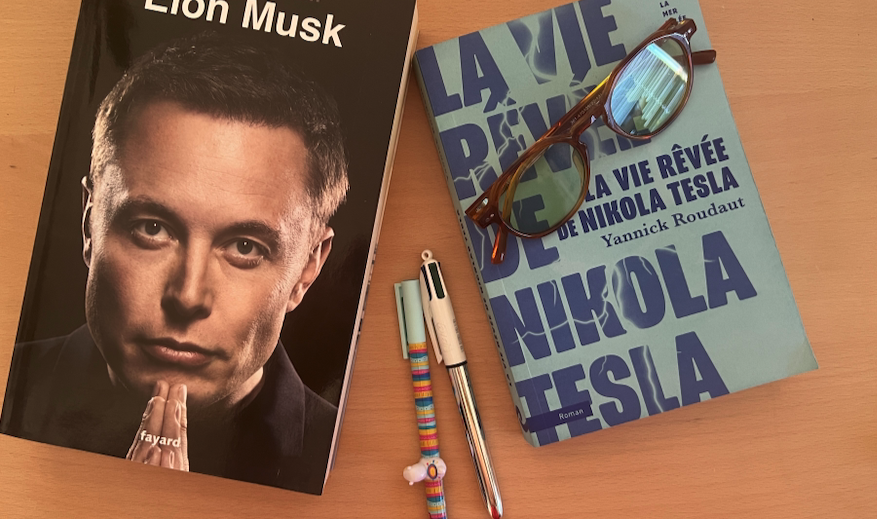

# Quand les rêves de Nikola Tesla rencontrent l’Intelligence Artificielle  

> *« La science est une perversion si son but n’est pas d’améliorer les conditions de l’humanité »* — N. Tesla, *The Century Magazine*, 1900  

En découvrant l'oeuvre de **Yannick Roudaut : La vie rêvée de nicolas Tesla** j’ai eu l’impression de dépoussiérer des carnets de laboratoire : tout ce que Tesla promettait de l’électricité ressemble aujourd’hui aux promesses — et aux craintes — qui entourent l’IA. Voici trois parallèles saillants, quelques chiffres vérifiés… et un clin d’œil historique aux taxis électriques de 1900.

## 1. « Libérer les hommes des tâches ingrates »  
|  | Électrification (1882‑1930) | IA générative (2022‑2025) |
|---|---|---|
| % d’adoption | 70 % des foyers US urbanisés en 1930 | 78 % des entreprises mondiales utilisent l’IA en 2024 |
| Temps pour atteindre le seuil | ≈ 48 ans (de la première centrale de NY à 70 %) | **3 ans** (ChatGPT → usage de masse) |

Les éclairages publics de Tesla devaient rendre les rues « plus sûres ». Aujourd’hui, la computer‑vision fait pareil : détection d’obstacles pour la voiture autonome ou caméras anti‑intrusion. La différence ? La scalabilité quasi instantanée du logiciel : un algorithme se déploie à la vitesse d’internet, quand poser un câble haute‑tension exigeait une armée d’ouvriers.

---

## 2. « Soulager le travail des enfants et permettre l’étude à la lumière d’une ampoule »  
Tesla rêvait de machines éliminant les corvées physiques ; l’IA, elle, **automatise la corvée cognitive** : rédaction de fiches, traduction, support client.  

- **Productivité** : les gains mesurés en call‑center dépassent +14 % après six mois d’IA d’assistance, surtout chez novices.
- **Éducation** : plus de 350 M d’utilisateurs devraient exploiter des tuteurs IA en 2025, dopant un marché du *ed‑tech* déjà estimé à **66,8 M$** cette année.  

À l’image de la lampe qui prolongeait la journée d’école, le GPT‑prof particulier multiplie le « temps de cerveau » disponible.

---

## 3. « Des machines pour produire nourriture et objets ; la paix serait naturelle »  
Entre 1890 et 1900 Tesla associe abondance énergétique et concorde. La question énergétique se déplace :  

| 2024 | 2030 (projection IEA) |
|---|---|
| 415 TWh consommés par les data‑centres (≈ 1,5 % de l’électricité mondiale) | **945 TWh** attendus, soit l’équivalent du Japon entier |

Si l’IA tient sa promesse de **diviser par 40 le coût d’inférence** (benchmark GPT‑3.5), elle pourrait offrir un « kilowatt‑heure cognitif » plus propre que le kilowatt mécanique de 1900. Mais, tout comme les turbines de Westinghouse dépendaient du charbon, le nuage d’IA dépend encore du mix électrique ; la paix numérique passera par des serveurs bas‑carbone.

---

## 4. Les détracteurs : de la chaise électrique au scénario « IA d’extermination »  
En 1890, on brandit la première exécution sur chaise électrique pour discréditer le courant alternatif — Tesla redoutait qu’on « tue » sa technologie ; pourtant l’AC s’est imposé. Aujourd’hui, les *doomers* prophétisent une IA qui « éteindra l’humanité ». L’histoire suggère qu’une démonstration macabre n’arrête pas un progrès utile ; elle **déclenche plutôt régulation et normes** (exécution → étiquetage “danger AC”, *ChatGPT* → IA Act européen).

---

## 5. Petit détour : les taxis électriques de 1900 et ceux (autonomes) de 2025  
| Date | Véhicule | Nombre | Vitesse/Autonomie |
|---|---|---|---|
| 1899 | **Electrobat** | « plusieurs centaines » de cabs à New York | ~32 km d’autonomie |
| 29 avr. 1899 | *La Jamais Contente* | 1 prototype | **105,88 km/h** record mondial |
| 2025 | Waymo & Baidu GO | 35 000 robotaxis | Autonomie logicielle : 20 h/j — vitesse 0‑110 km/h |

Les batteries au plomb limitaient Tesla ; les *lithium‑fer‑phosphate* d’aujourd’hui alimentent… du calcul neuronal. L’électricité reste la colonne vertébrale, mais c’est l’IA qui tient le volant.

---

## Conclusion : un même fil conducteur  
Tesla voyait l’énergie comme **multiplicateur d’humanité**. L’IA ajoute la **dimension cognitive** à ce multiplicateur. Les deux révolutions partagent :  

1. **Une utilité évidente** — éclairer / automatiser l’écrit.  
2. **Des peurs spectaculaires** — chaise électrique / IA hors‑contrôle.  
3. **Un besoin d’infrastructures** — réseaux haute tension / data‑centres sobres.  

À nous de rappeler sa maxime : science et IA ne vaudront que **si elles améliorent concrètement la vie de chacun**. Sinon, pour reprendre Tesla, elles ne seraient qu’« une perversion ».  

---

## Source du livre

- L’électricité libérerait les hommes de tâches ingrates, les rues des villes seraient éclairées et donc plus sures. Le procès profiterait à tous. « La science n’est qu’une perversion si son but n’est pas d’améliorer les conditions de l’humanité » p.46

- « En apportant l’énergie électrique aux Américains, nous lutterons contre la misère et la pauvreté. Les machines électriques pourront soulager le travail et notamment celui des enfants. Ils n’auront plus à travailler et pourront étudier à la lumière d’une ampoule » p.49

- Si des machines nous permettaient de réaliser nos objets, de produire notre nourriture, sans efforts, les humains auraient plus de temps à consacrer à l’apprentissage des connaissances, à la découverte des autres cultures, à la compréhension de l’autre dans ses différences. La paix serait naturelle. p.74

- Nous vivons une révolution scientifique et technologique inédite dans l’histoire de l’humanité. Les vingts prochaines années seront plus riches en découvertes que l’ensemble du siècle que nous finissons de traverser p.109 

- Il pensa également à la déflagration que cette exécution aurait dans le monde de l’électricité. Quand l’opinion publique découvrirait l’efficacité de sa chaise (chaise d’exécution pour les peines de mort), le déploiement à grande échelle du courant alternatif serait stoppé. p.67

- Les taxis électriques Electrobat de Morris et Salim se développaient également rapidement. Une centaine de véhicules en libre partage étaient déjà disponibles dans New York. Ces nouveaux moyens de locomotion propres destinés à remplacer les voitures à cheval. p.177

- Les premiers véhicules électriques roulaient dès le début du XXe siècle. La Jamais contente, construite en Belgique par les ateliers Jenatzy, avait franchi le cap des cent kilomètres-heure, le 29 Avril 1899, à Achères. Des compagnies de taxis roulaient à l’électrique jusqu’en 1907 dans les rues de New York ! p. 236

## Nombre de lecteur 

